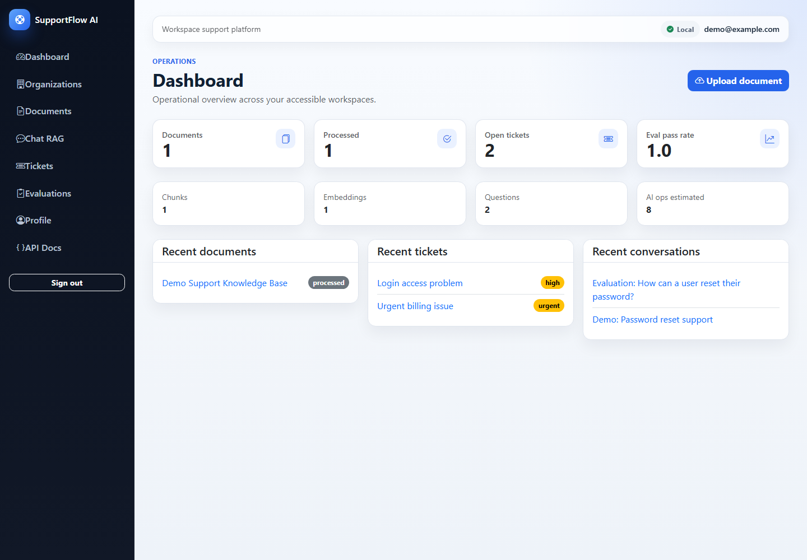
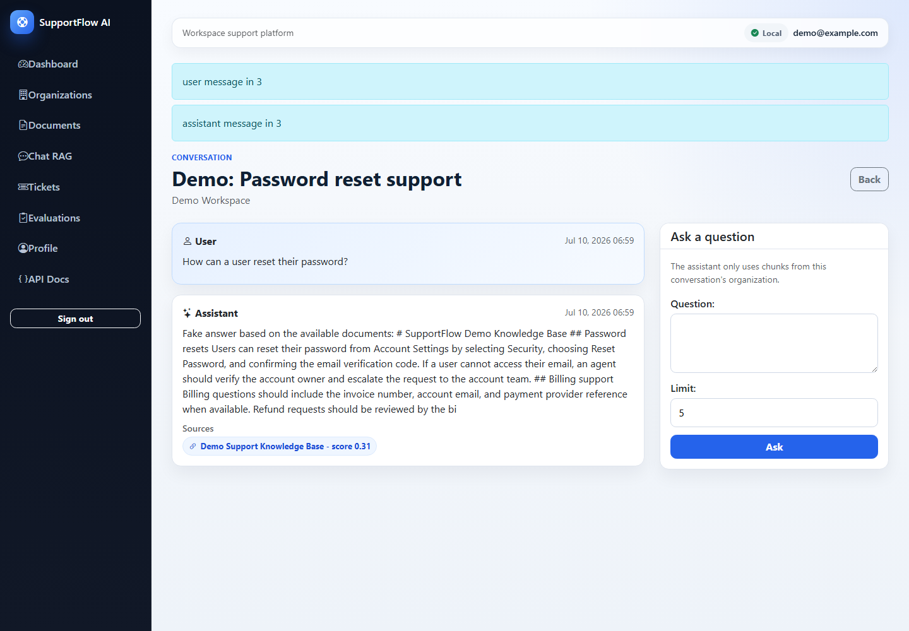
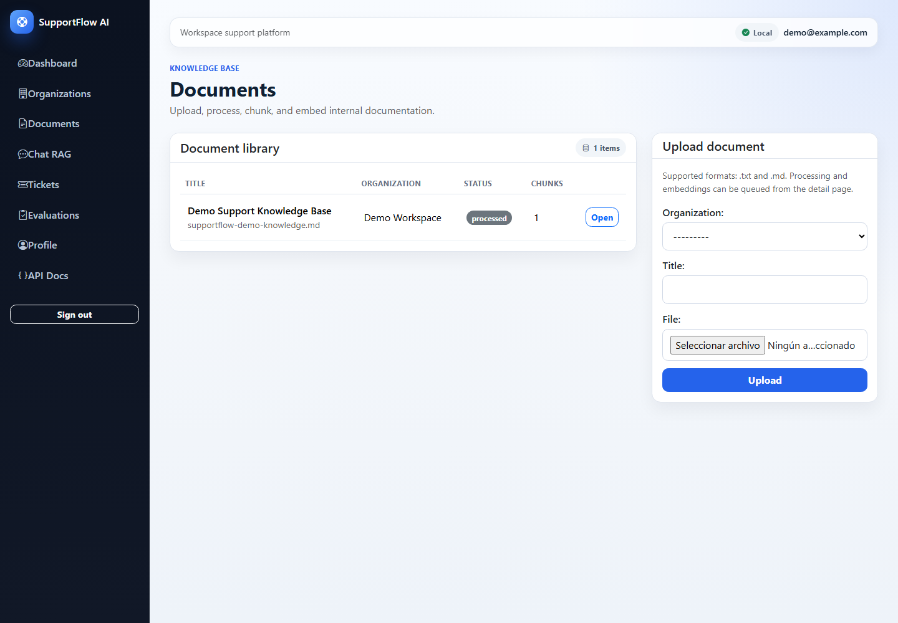
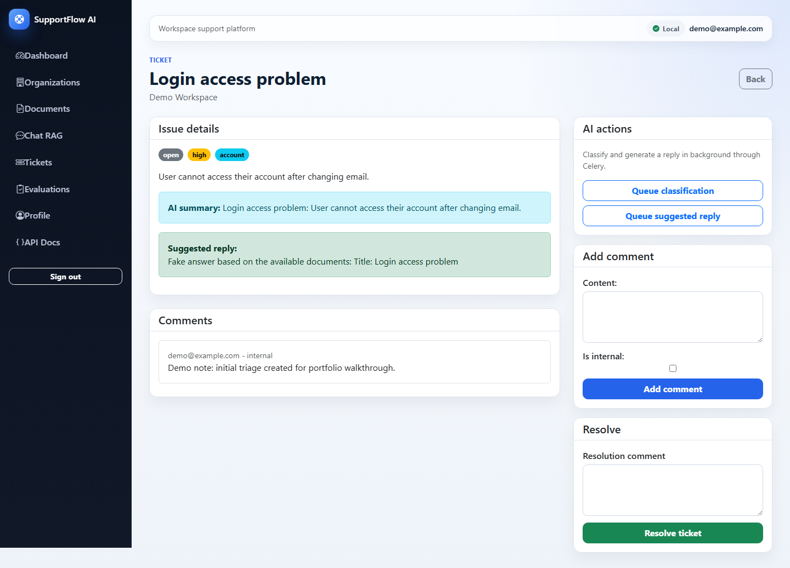
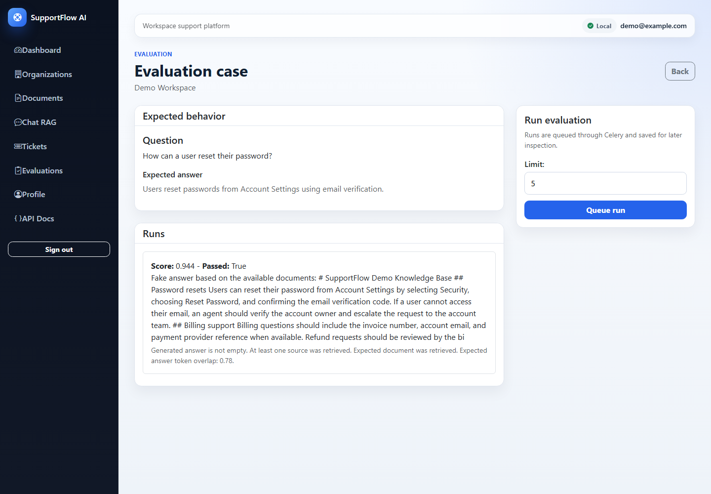
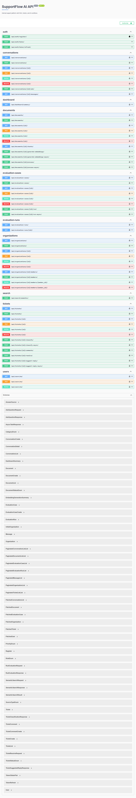

# SupportFlow AI

[](https://github.com/ysf98/supportflowai/actions/workflows/ci.yml)


**SupportFlow AI** is a professional fullstack internal SaaS platform for enterprise support teams.

It combines document ingestion, semantic search, RAG answers with cited sources, AI-assisted ticket workflows, evaluation runs, dashboard metrics, Celery background jobs, organization-based permissions, OpenAPI documentation, Docker, and a server-rendered web UI.

This project is built as a portfolio-grade Django application: realistic architecture, clean domain boundaries, tests, security notes, documentation, and demo data.

---

## 📸 Screenshots

| Dashboard | RAG Chat |
| --- | --- |
|  |  |

| Documents | Ticket Detail |
| --- | --- |
|  |  |

| Evaluation Detail | OpenAPI / Swagger |
| --- | --- |
|  |  |

---

## ✨ What It Does

- Upload internal `.txt` and `.md` documentation.
- Extract text and split documents into deterministic chunks.
- Generate embeddings and store vectors in PostgreSQL with pgvector.
- Search documentation semantically, always scoped by organization.
- Ask RAG questions and receive assistant answers with cited sources.
- Manage support tickets, comments, status, priority, category, and assignment.
- Use AI services to classify tickets, summarize issues, and suggest replies.
- Run evaluation cases to check RAG answer quality.
- View operational metrics in a dashboard.
- Explore a documented REST API through Swagger/OpenAPI.
- Run the whole stack locally with Docker Compose.

---

## 🧠 Why This Project Is Interesting

SupportFlow AI demonstrates the kind of backend work expected in real SaaS products:

- **Multi-tenant data isolation** with organizations and memberships.
- **Role-based permissions** for `owner`, `admin`, `agent`, and `viewer`.
- **Service-layer architecture** instead of putting business logic inside views.
- **AI provider abstraction** with deterministic fake AI for tests and OpenAI-ready providers for real usage.
- **RAG with sources** instead of a simple chatbot.
- **Async processing** with Celery and Redis for longer-running workflows.
- **Professional testing** covering APIs, services, permissions, OpenAPI, security regressions, web views, and async tasks.
- **Portfolio-ready documentation** explaining architecture, business rules, RAG design, hardening, and demo flow.

---

## 🧱 Tech Stack

| Area | Tools |
| --- | --- |
| Backend | Python, Django, Django REST Framework |
| Database | PostgreSQL, pgvector |
| Async | Celery, Redis |
| Auth | Custom email user, SimpleJWT, Django sessions for web UI |
| AI | FakeAIProvider, OpenAIProvider, embeddings, RAG, prompt templates |
| API Docs | drf-spectacular, Swagger UI |
| Testing | pytest, pytest-django |
| Frontend | Django Templates, Bootstrap 5 |
| DevOps | Docker, Docker Compose, GitHub Actions |

---

## 🗂️ Project Structure

```txt
apps/
  ai/              AI providers, prompts, shared AI exceptions
  chat/            RAG conversations, messages, answer sources
  core/            shared permissions, pagination, helpers
  dashboard/       organization-scoped metrics
  documents/       uploads, extraction, chunking, document APIs
  embeddings/      embedding generation and semantic search
  evaluations/     RAG evaluation cases and runs
  organizations/   workspaces, memberships, roles
  tickets/         support tickets, comments, AI ticket workflows
  users/           custom email user, auth, profile endpoints
  web/             server-rendered demo UI
config/
  settings/        environment-specific Django settings
docs/              architecture, API, RAG, testing, hardening, portfolio docs
requirements/      base, development, production, test dependencies
tests/             API, service, permission, security, web, async tests
```

---

## 🚀 Quick Start

Create your local environment file:

```bash
cp .env.example .env
```

Build and start the stack:

```bash
docker compose up --build
```

Run migrations:

```bash
docker compose exec web python manage.py migrate
```

Seed portfolio demo data:

```bash
docker compose run --rm web python manage.py seed_demo_data
```

Open the app:

```txt
http://127.0.0.1:8000/
```

Demo credentials:

```txt
Email:    demo@example.com
Password: DemoPass123!
```

---

## ✅ Verification Commands

```bash
docker compose config
docker compose build
docker compose run --rm web python manage.py check
docker compose run --rm web python manage.py makemigrations --check --dry-run
docker compose run --rm web pytest
docker compose run --rm web python manage.py spectacular --file /tmp/supportflow-schema.yml --validate
docker compose run --rm web python manage.py check --deploy --settings=config.settings.production
```

The repository also includes GitHub Actions CI for pushes and pull requests to `main`.

---

## 🔐 Authentication And Roles

SupportFlow AI uses a custom email-based user model.

When a user registers, the app automatically creates an initial organization to make the demo flow smoother.

Initial roles:

```txt
owner
admin
agent
viewer
```

Every major resource belongs to an organization, and API/web access is filtered by membership and role.

---

## 🤖 AI And RAG

The AI layer is intentionally abstracted:

- `FakeAIProvider` returns deterministic embeddings and generated text for local development and tests.
- `OpenAIProvider` is prepared for real OpenAI usage when configured with environment variables.
- Tests force the fake provider and never call external services.
- Semantic search uses pgvector and always filters by organization.
- RAG answers store the assistant message plus the exact document chunks used as sources.

Important technical note:

```txt
The current development setup uses 16-dimensional fake embeddings.
Before using real OpenAI embeddings in production, migrate the vector dimension
to match the selected embedding model.
```

Relevant environment variables:

```txt
AI_PROVIDER=fake
SUPPORTFLOW_EMBEDDING_DIMENSIONS=16
FAKE_EMBEDDING_DIMENSIONS=16
OPENAI_API_KEY=
OPENAI_CHAT_MODEL=
OPENAI_EMBEDDING_MODEL=text-embedding-3-small
```

---

## 🧪 Testing

The test suite covers:

- user registration and JWT auth,
- organization membership and role permissions,
- document upload, validation, extraction, and chunking,
- pgvector-backed embedding flows with fake deterministic vectors,
- semantic search isolation by organization,
- RAG conversations and cited sources,
- ticket workflows and AI-assisted actions,
- evaluation cases and runs,
- dashboard metrics,
- async Celery task wrappers,
- web views,
- OpenAPI schema validation,
- security and multi-tenant regression tests.

Run tests:

```bash
docker compose run --rm web pytest
```

Current local suite:

```txt
114 passed
```

---

## 🧭 Demo Flow

Recommended walkthrough for interviews:

1. Log in with the demo user.
2. Open the dashboard and explain organization-scoped metrics.
3. Show uploaded documents and generated chunks.
4. Open Chat RAG and ask a question about internal documentation.
5. Point out the cited document source.
6. Open a ticket and show status, priority, category, comments, and AI suggestions.
7. Open evaluations and show how RAG answers can be tested.
8. Open Swagger UI and highlight the REST API surface.
9. Mention CI, tests, Docker, hardening docs, and async workflows.

---

## 🔌 Main API Areas

Swagger UI is available when the server is running:

```txt
http://127.0.0.1:8000/api/docs/
```

Endpoint groups:

```txt
/api/auth/
/api/users/
/api/organizations/
/api/documents/
/api/search/semantic/
/api/conversations/
/api/tickets/
/api/evaluation-cases/
/api/evaluation-runs/
/api/dashboard/summary/
```

Example semantic search payload:

```json
{
  "organization": 1,
  "query": "How do I reset my password?",
  "limit": 5
}
```

---

## ⚙️ Async Processing

Celery and Redis are configured for background workflows.

Current async coverage:

- process documents,
- generate document embeddings,
- generate pending organization embeddings,
- classify tickets,
- suggest ticket replies,
- run evaluation cases.

Check the worker:

```bash
docker compose exec worker celery -A config inspect ping
```

---

## 📚 Documentation

| Document | Purpose |
| --- | --- |
| [docs/ARCHITECTURE.md](docs/ARCHITECTURE.md) | System design and app boundaries |
| [docs/API.md](docs/API.md) | REST API notes and endpoint groups |
| [docs/RAG.md](docs/RAG.md) | Embeddings, retrieval, prompts, sources |
| [docs/BUSINESS_RULES.md](docs/BUSINESS_RULES.md) | Roles, permissions, statuses, workflows |
| [docs/ASYNC.md](docs/ASYNC.md) | Celery and Redis background processing |
| [docs/WEB.md](docs/WEB.md) | Server-rendered web interface |
| [docs/TESTING.md](docs/TESTING.md) | Testing strategy and commands |
| [docs/HARDENING.md](docs/HARDENING.md) | Security baseline and future hardening |
| [docs/DEMO_DATA.md](docs/DEMO_DATA.md) | Demo seed command and credentials |
| [docs/PORTFOLIO.md](docs/PORTFOLIO.md) | Interview/demo guide |

---

## 🧑‍💻 Portfolio Summary

Suggested CV bullet:

```txt
Built SupportFlow AI, a Django/DRF internal support SaaS platform with
organization-based permissions, document ingestion, pgvector semantic search,
RAG answers with cited sources, AI-assisted ticket workflows, Celery background
tasks, dashboard metrics, OpenAPI docs, Docker setup, GitHub Actions CI, and
100+ automated tests.
```

Best files to discuss in interviews:

```txt
apps/chat/services.py
apps/ai/providers.py
apps/embeddings/services.py
apps/documents/services/processing.py
apps/tickets/services.py
apps/evaluations/services.py
apps/organizations/permissions.py
tests/security/test_permission_regressions.py
tests/api/test_api_contract.py
```

---

## 🛣️ Future Improvements

- Task status polling UI for async jobs.
- PDF parsing.
- Audit logs for sensitive actions.
- Rate limiting.
- Real OpenAI embedding dimension migration.
- More advanced evaluation scoring.
- Deployment hardening for a production environment.

---

## 📄 License

Portfolio project. Add a license before using it as a public reusable template.
